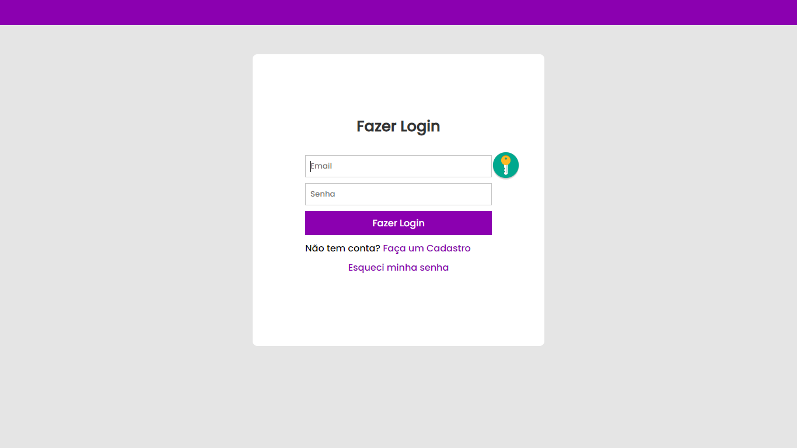
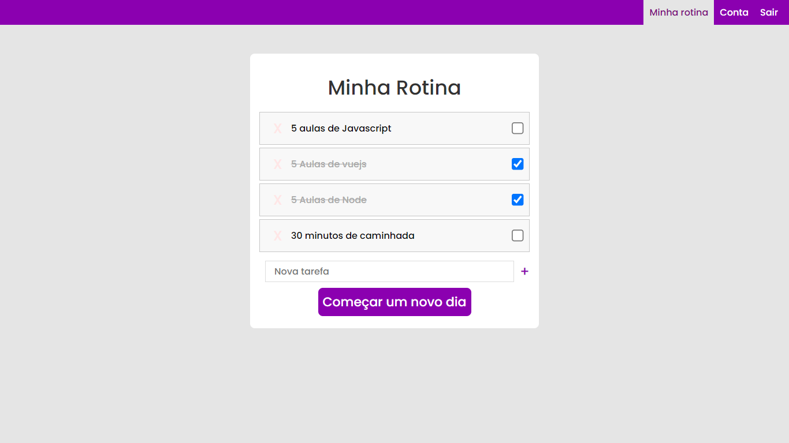

<div align="center">
    
    
    
    
    
</div>

<h3 align="center">Programa de controle de rotina em PHP</h3>
<p align="center">
    Um programa de controle de rotina, onde através de um cadastro na plataforma é possível fazer o gerenciamento de tarefas que devem ser cumpridas durante um dia.
    <br>
    <a href="https://gabrielogregorio.com/projetos/minha-rotina/"><strong>Ver demonstrativo »</strong></a>
    <br>
</p>

<h3>Informações gerais</h3>


### Introdução
Esse projeto se trata de um estudo de PHP, onde podemos criar uma conta através de e-mail e senha, e podemos então adicionar tarefas que deverão ser cumpridas durante a rotina, como caminhadas, checar e-mails ou assistir uma aula de Javascript por exemplo.

### Como iniciar
Faça download do projeto e descompacte na pasta raíz do seu servidor web (www, htdocs, public_html etc) e execute o comando abaixo:

```shell
composer install --no-dev
```

Edite o arquivo config/config.php com o editor de sua preferência e altere a url base do sistema e as credenciais de acesso ao banco de dados.

Importe o banco de dados através do arquivo de dump que está localizado em sql/my_routine_schema.sql ou crie diretamente através dos comandos abaixo:

```sql
CREATE DATABASE IF NOT EXISTS `my_routine` /*!40100 DEFAULT CHARACTER SET utf8mb4 COLLATE utf8mb4_general_ci */;

USE `my_routine`;

CREATE TABLE IF NOT EXISTS `users` (
  `user_id` int(10) unsigned NOT NULL AUTO_INCREMENT,
  `username` varchar(100) NOT NULL DEFAULT '',
  `password` varchar(150) NOT NULL DEFAULT '',reorganização do projeto
  `created_at` datetime NOT NULL DEFAULT current_timestamp(),
  `updated_at` datetime NULL DEFAULT NULL ON UPDATE current_timestamp(),
  PRIMARY KEY (`user_id`),
  UNIQUE KEY `UQ_username` (`username`)
) ENGINE=InnoDB DEFAULT CHARSET=utf8mb4 COLLATE=utf8mb4_general_ci;

CREATE TABLE IF NOT EXISTS `tasks` (
  `task_id` int(10) unsigned NOT NULL AUTO_INCREMENT,
  `user_id` int(10) unsigned NOT NULL DEFAULT 0,
  `task_name` varchar(50) NOT NULL DEFAULT '',
  `task_description` tinytext NULL DEFAULT NULL,
  `task_status` varchar(20) NOT NULL DEFAULT '',
    `is_checked` tinyint(1) NOT NULL DEFAULT 0,
  `created_at` datetime NOT NULL DEFAULT current_timestamp(),
  `updated_at` datetime NULL DEFAULT NULL ON UPDATE current_timestamp(),
  PRIMARY KEY (`task_id`),
  KEY `FK_tasks_user_id` (`user_id`),
  CONSTRAINT `FK_tasks_user_id` FOREIGN KEY `user_id` (`user_id`)
  REFERENCES `users` (`user_id`)
    ON DELETE CASCADE ON UPDATE NO ACTION
) ENGINE=InnoDB DEFAULT CHARSET=utf8mb4 COLLATE=utf8mb4_general_ci;
```

Pronto, agora você só precisa executar o servidor apache.

### Capturas de tela


